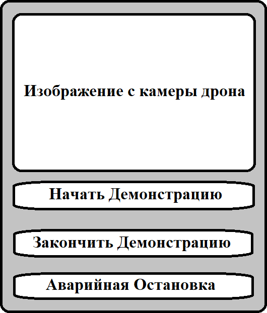

# mse1h2024-drones

## Итерация 1

### Подробная постановка задачи

Проект используется для демонстрации возможностей кафедры. На полигоне есть робот-тележка с прикрепленным на его спину qr кодом. Код решения предварительно скачан с github. При помощи единственной команды этот код запущен. Решение управляет полетом дрона Tello. У пользователя есть возможность отдать 4 команды: начать демонстрацию, закончить демонстрацию, посмотреть на то что видит камера дрона, аварийная остановка. Во время демонстрации дрон поднимается в воздух, направляет камеру на qr код и стремиться видеть qr код в течение всей демонстрации.

### Собранные и проанализированные требования

- (Задача минимум) Определить начальные условия, при которых работает решение.
- (Задача минимум) Дрон следит за qr кодом хотя бы как-нибудь.
- (Задача минимум) Решение работает на каком-нибудь симуляторе.
- (Уже устроит) Движение дрона управляется PID-регулятором.
- (Уже устроит) Дрон должен всегда видеть qr код, после того, как увидел его в первый раз.
- (Максимум) Решение одинаково хорошо работает как на симуляторе, так и на реальном дроне.

### Сценарий использования

1. Пользователь загружает код созданного решения.
1. Пользователь располагает робота-тележку с наклеенным на него qr кодом и дрона так, как описано в начальных условиях.
1. Пользователь запускает решение.
1. Пользователь нажимает на кнопку *начать демонстрацию*.
1. Дрон располагается в воздухе так, чтобы видеть qr код.
1. Робот-тележка начинает двигаться по полигону.
1. Дрон меняет свое положение таким образом, чтобы всегда видеть qr код.
1. Пользователь нажимает на кнопку *закончить демонстрацию*.
1. Дрон приземляется.

### Макет UI



## Итерация 3

### Готово

- На сцену добавлен маркер, а также создана логика для управления его движением.
- Настроен автоматический sanity check: проверка того, что все части проекта собираются.
- GUI отдает команды дрону и принимает изображение с его камеры.

### В работе

- Интеграция pid-регулятора
- Определение маркера на изображении с камеры

### Инструкции по запуску

Для запуска симуляции см. [инструкцию](./wiki/simulation.md).

Для запуска GUI потребуется выполнить команды

```
cd gui
pip install -r requirements.txt
source /opt/ros/iron/setup.bash
python gui.py
```

[Что должно быть, если все хорошо](https://drive.google.com/file/d/1lYbNuMoYIauSJVRvCgQhj5nWbGn3XOIE/view?usp=sharing)

### Презентация

https://docs.google.com/presentation/d/1rUaw3MloKnwjV1p0Nc5rlmjW4V7hkWq3fldU29A1Iws/edit?usp=sharing
